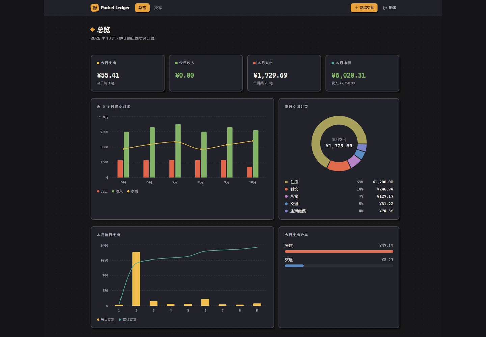
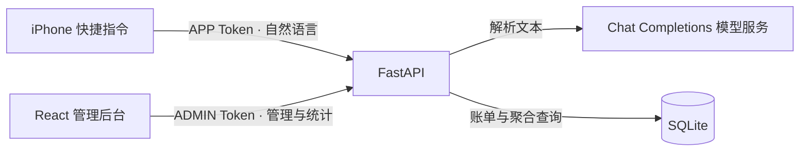

<div align="center">

# Pocket Ledger

**一句话记账，一个后台看清收支。**

面向个人的自托管记账应用 · 自然语言录入 · 账单管理 · 收支可视化

[](requirements.txt)
[](app/main.py)
[](frontend/package.json)
[](https://github.com/HHN224/bill-engine/stargazers)

[界面预览](#界面预览) · [快速开始](#快速开始) · [架构](#架构) · [部署](#部署) · [文档](#文档)

</div>

## 界面预览



<p align="center"><sub>本地运行的真实管理后台；截图使用演示账单，统计由后端计算。</sub></p>

Pocket Ledger 将日常记账串成一条完整流程：通过 iPhone 快捷指令输入一句话，模型解析出结构化账单，再在浏览器中查询、修正和分析。手工记账与管理功能可以独立运行，只有自然语言解析需要连接模型服务。

## 能做什么

| 场景 | 已实现能力 |
| --- | --- |
| 随手记一笔 | 解析金额、收支类型、分类、时间、商户、支付方式与备注；缺少有效金额时返回待确认结果，不写入数据库 |
| 管理账单 | 手工新增、分页查询、编辑与删除；按日期、类型、分类和关键词筛选 |
| 查看收支 | 今日与本月指标、近六个月收支对比、分类环形图、每日支出与累计趋势 |
| 带走数据 | 将全部账单导出为 CSV，不受当前列表筛选条件影响 |
| 自己部署 | SQLite 存储、Alembic 迁移、Docker Compose 与 Caddy 同源部署 |

## 快速开始

本地开发需要 **Python 3.11+**、**Node.js 22.12+** 和 Git。以下命令使用 Windows PowerShell。

### 1. 安装后端

```powershell
git clone https://github.com/HHN224/bill-engine.git
cd bill-engine
python -m venv .venv
.\.venv\Scripts\python.exe -m pip install -r requirements.txt
Copy-Item .env.example .env
```

编辑 `.env`：将 `APP_API_TOKEN` 和 `ADMIN_API_TOKEN` 替换为两枚不同的长随机值。需要自然语言记账时，再填写 `LLM_API_KEY`、`LLM_BASE_URL` 和 `LLM_MODEL`；仅体验管理后台和手工记账可以不配置模型密钥。

初始化数据库并启动 API：

```powershell
.\.venv\Scripts\python.exe -m alembic upgrade head
.\.venv\Scripts\python.exe -m uvicorn app.main:app --host 127.0.0.1 --port 8000
```

### 2. 启动前端

另开一个 PowerShell 终端，在仓库根目录执行：

```powershell
cd frontend
npm.cmd ci
npm.cmd run dev
```

打开 [管理后台](http://127.0.0.1:5173)，输入 `.env` 中的 `ADMIN_API_TOKEN`。新建数据库初始为空，添加账单后即可查看统计图。

<details>
<summary>macOS / Linux 安装与启动</summary>

```bash
git clone https://github.com/HHN224/bill-engine.git
cd bill-engine
python3 -m venv .venv
source .venv/bin/activate
python -m pip install -r requirements.txt
cp .env.example .env
# 编辑 .env，设置两枚不同的随机 Token。
python -m alembic upgrade head
python -m uvicorn app.main:app --host 127.0.0.1 --port 8000
```

另开终端，在仓库根目录运行 `cd frontend && npm ci && npm run dev`。

</details>

### 3. 接入 iPhone 快捷指令

将“询问输入”的结果作为 `text`，向 `/api/transactions/parse-and-create` 发送 JSON，并使用请求头 `Authorization: Bearer <APP_API_TOKEN>`。例如：

```json
{
  "text": "中午食堂牛肉饭18块5，微信支付",
  "timezone": "Asia/Taipei"
}
```

快捷指令展示响应中的 `message`；只有解析到有效金额时才创建账单。请求与响应字段见 [API 契约](docs/admin-api.md)。

## 架构



| 层 | 技术与职责 |
| --- | --- |
| 前端 | React 19、TypeScript、Vite、Tailwind CSS；TanStack Query 管理请求，Recharts 展示图表 |
| API | FastAPI 与 Pydantic，处理输入校验、账单管理和统计接口 |
| 持久化 | SQLAlchemy、SQLite 与 Alembic，保存账单并管理表结构迁移 |
| 入口与部署 | Bearer Token 分离权限；Caddy 托管前端并代理 API，Docker Compose 编排服务 |

当前为单用户系统。手机 Token 可解析记账与读取今日汇总；后台 Token 可管理账单和查看统计，两者不能互换。后台凭证只保存在页面内存中，刷新后需要重新输入。

## 部署

准备已解析到服务器的域名、Docker Compose，以及 80/443 端口。在 `.env` 中设置 `DOMAIN`、Token、模型配置和数据目录，然后执行：

```bash
docker compose up -d --build
```

Caddy 负责 HTTPS、前端静态资源与 API 反向代理；SQLite 数据通过宿主机目录持久化。备份、更新与恢复步骤见 [部署手册](docs/deployment.md)。

## 项目结构

```text
bill-engine/
├── app/                 # 路由、鉴权、模型解析与统计服务
├── data/                # 本地数据库；不纳入版本控制
├── docs/                # API、部署文档、架构决策与截图
├── frontend/            # React 管理后台与前端测试
├── migrations/          # Alembic 数据库迁移
├── tests/               # 后端单元与 API 测试
├── .env.example         # 环境变量说明
├── Caddyfile            # 同源入口与 HTTPS
├── Dockerfile           # 前端构建与服务镜像
├── docker-compose.yml   # 单机部署编排
└── requirements.txt     # Python 依赖
```

## 文档

| 想了解什么 | 从这里开始 |
| --- | --- |
| 接口、字段与错误格式 | [后台 API 契约](docs/admin-api.md)；运行中的 [Swagger UI](http://127.0.0.1:8000/docs) |
| 配置环境变量 | [配置示例](.env.example) |
| 部署、备份与恢复 | [部署手册](docs/deployment.md) |
| 领域规则与功能边界 | [领域术语](CONTEXT.md) · [后台 MVP 边界](docs/admin-backlog.md) |
| 为什么采用双 Token | [权限拆分 ADR](docs/adr/0002-separate-shortcut-and-admin-tokens.md) |

<details>
<summary>开发与检查命令</summary>

在仓库根目录运行后端测试和迁移检查：

```powershell
.\.venv\Scripts\python.exe -m pytest -q
.\.venv\Scripts\python.exe -m alembic check
```

在 `frontend/` 中运行：

```powershell
npm.cmd run test
npm.cmd run lint
npm.cmd run typecheck
npm.cmd run build
```

端到端测试需要先启动后端，再设置 `E2E_ADMIN_TOKEN` 为本地管理 Token，运行 `npm.cmd run test:e2e`。

</details>

欢迎通过 [Issue](https://github.com/HHN224/bill-engine/issues) 反馈问题。提交修改前运行相关检查，避免提交 `.env`、真实账单数据库和密钥。仓库目前未附带独立的 LICENSE 文件。
